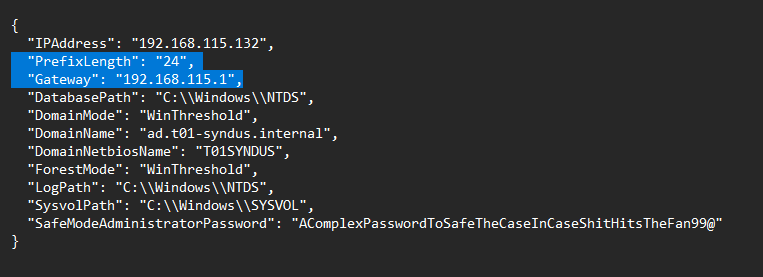

# Procedure setup voor Windows testen

## Inleiding

Om de Windows server en clients te testen zonder op fysieke locatie aanwezig te zijn, is er gekozen om te werken met een NAT netwerk binnen VirtualBox. Op deze manier is er communicatie mogelijk tussen de machines en met het internet.

## VirtualBox configuratie

1. Maak een NAT netwerk aan in de netwerk GUI interface van VirtualBox
2. De naam mag vrij gekozen worden
3. Kies als prefix voor `192.168.115.0/24`
4. Selecteer de `Enable DHCP` optie voor de Windows client
5. IPv6 moet niet toegepast worden
6. Er moeten geen port forwarding regels ingesteld worden

Onderstaande printscreen toont de gewenste instellingen nog eens visueel aan:

7. Power down al de virtuele Windows machines
8. Pas de NIC van elke VM aan naar `NAT Network` en kies de nieuw aangemaakte interface

## Servers configuratie

1. Open de JSON config files voor beide servers
2. Pas de lijn `PrefixLength` aan naar `24`
3. Pas de lijn `Gateway` aan naar `192.168.115.1` _(let op om deze changes niet naar GIT mee te pushen)_

Onderstaande printscreen toont de gewenste instellingen nog eens visueel aan:

## Client configuratie

1. Start de VM
2. Open `Network and Sharing center`
3. Kies in het linkse menu voor `Change adapter settings`
4. Right click de `Ethernet` adapter en kies `Properties`
5. Vink `Internet Protocol Version 6` af
6. Selecteer `Internet Protocol Version 4` en kies voor de knop `Properties`
7. Het IP address menu van het nieuwe scherm mag je default laten, aangezien ons NAT Netwerk DHCP addressen uitdeelt
8. Voor de DNS kies het volgende `Use the following DNS server addresses:`
9. Als preffered kies voor het dc1 address op `192.168.115.132` en als alternate kies je voor Google DNS op `8.8.8.8`
10. Klik ok

