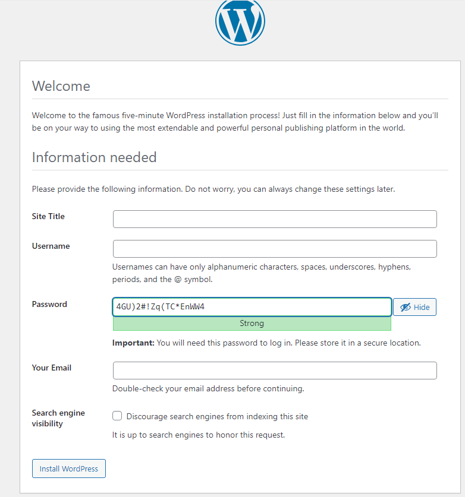
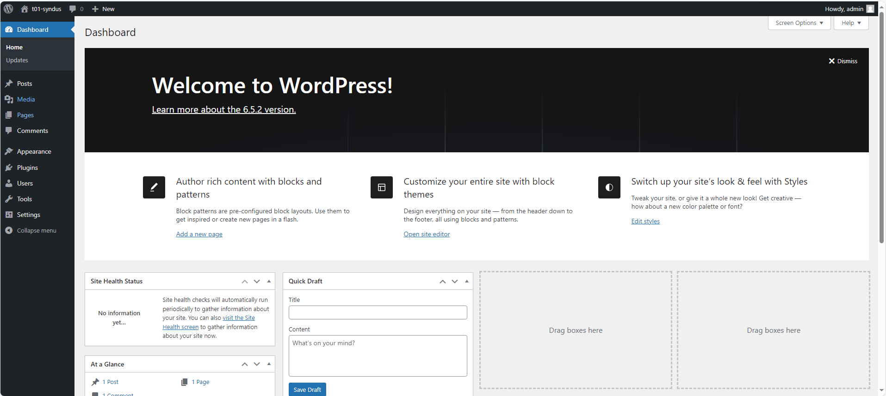
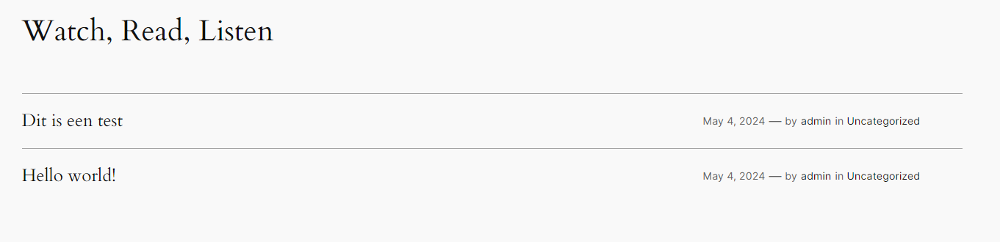

# Procedure setup voor WordPress site

Het volgende document is de procedure om de WordPress site op te stellen, dit is geen automatisch proces.

## Prerequistes

1. De webserver is actief en succesvol geconfigureerd
2. De databaseserver is actief en succesvol geconfigureerd
3. De proxy is actief en succesvol geconfigureerd

## Stappenplan

1. Begin met te surfen naar de webpagina, een automatische redirect naar `/wp-admin/install.php` vind plaats. Je krijgt het volgende scherm te zien:

2. We vullen de volgende waarden in:
   1. Site Title: `t01-syndus`
   2. Username: `admin`
   3. Password: _use the auto generated password, but write it down in a notepad for further use_
   4. Email: `test@t01-syndus.internal`
3. Druk op de `install WordPress` button
4. Je krijgt een scherm dat de WordPress installatie succesvol was:

5. Druk op de login knop en log in op de webapplicatie
6. Je krijgt een overzicht van het dashboard te zien:

7. Navigeer naar het `Posts` submenu en kies voor `Add New Post`
8. Geef wat inhoud aan de testpost en druk op `Publish` rechtsboven
9. Navigeer opnieuw naar de webpagina landing page
10. Navigeer naar de post sectie en controleer of de post correct is aangemaakt:

11. Als de post correct wordt weergeven, is voldaan aan de PoC voor de WordPress installatie
