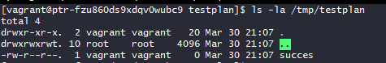
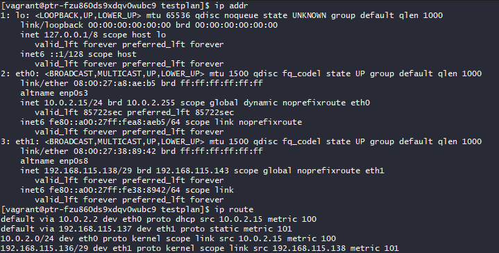
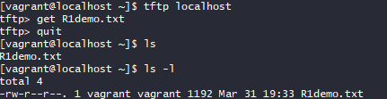
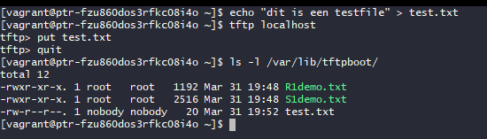

# Testplan TFTP server

- Auteur(s) testplan: Jelle

## Test: Vagrant build en provision

Testprocedure:

1. Start de virtuele machine met `vagrant up tfpt`
2. Eens het script is afgerond, gebruik `vagrant ssh tfpt` en connecteer naar de machine
3. Navigeer naar `/tmp/testplan` en controleer of de "succes" file is aangemaakt

Verwacht resultaat:

- Er worden geen errors weergegeven in de uitvoering van de vagrant build en provisioning
- Je kan connecteren naar de machine
- De "succes" file is aanwezig in de `/tmp/testplan` directory _(output getoond in screenshot)_

## Test: De netwerkinstellingen staan correct

Testprocedure:

1. Controleer met `nmcli connection show` of de correcte interfaces zijn aangemaakt, aangevuld met een check in de virtualbox GUI
2. Controleer met `ip addr` of het correcte IP address is toegevoegd op de bridged adapter
3. Controleer of de interface "UP" is
4. Controleer met `ip route` of de correcte gateway is toegevoegd op de bridged adapter

Verwacht resultaat:

- Er zijn 2 adapters aangemaakt, een NAT en een bridged. De bridged adapter moet uiteraard de juiste interface van je fysieke machine gekoppeld hebben.
- De eth1 van de machine heeft 192.168.115.138/29 als IP toegekend gekregen
- De eth1 staat in de state UP
- De eth1 van de machine heeft 192.168.115.137 als default gateway toegekend gekregen

## Test: TFTP get lokaal

Testprocedures:

1. Installeer de TFTP-client met `sudo dnf install tftp -y`
2. Connecteer lokaal met de TFTP client doormiddel van `tftp localhost`
3. Probeer een file te fetchen van de tftp server doormiddel van het `get <file>` commando
4. Valideer of de file met zijn inhoud in de directory is bijgekomen

Verwacht resultaat:

1. De tftp server is lokaal te bereiken
2. De file die je fetch wordt met correcte inhoud in working directory geplaatst

## Test: TFTP put lokaal

Testprocedures:

1. Maak een testfile aan en geef het een inhoud vanuit de homedirectory
2. Connecteer lokaal met de TFTP client doormiddel van `tftp localhost`
3. Probeer de nieuw aangemaakte file te pushen doormiddel van het `push <file>` commando
4. Valideer of de file met correcte inhoud is aangemaakt in de tftp folder

Verwacht resultaat:

1. De file die je pusht is met correcte inhoud in de tftp directory geplaatst

