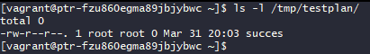
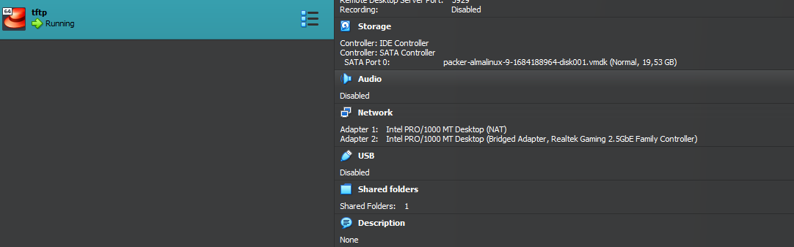
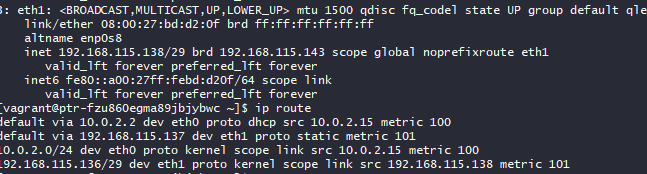
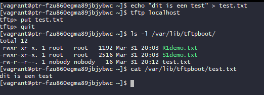

# Testrapport

- Uitvoerder(s) test: Jelle
- Uitgevoerd op: 31/03/2024
- Github commit: [15225b3](https://github.com/HoGentTIN/sep2324-tiao-t01/commit/15225b3b62dd396666a6119cf4257f1a484e7c1b)

## Test: Vagrant build en provision

Test procedure:

1. De virtuele machine is gestart via Vagrant
2. Er is verbonden via ssh op de virtuele machine
3. Validatie of de succes file is aangemaakt op de server

Verkregen resultaat:

- De VM is correct aangemaakt volgens vagrant output en is te bereiken
- De succes file is aanwezig in de gewenste directory

Test geslaagd:

- [x] Ja
- [ ] Nee

## Test: De netwerkinstellingen staan correct

Test procedure:

1. Er is een visuele check gebeurt om te kijken of de correcte interfaces zijn aangemaakt en correct gekoppeld
2. Er is gecontroleerd of het correcte IP address is toegevoegd op de bridged adapter
3. Er is gecontroleerd of de interface "UP" is
4. Er is gecontroleerd of de correcte gateway is toegevoegd op de bridged adapter

Verkregen resultaat:

- Er zijn 2 adapters aangemaakt, een NAT en een bridged. De bridged adapter is correct gekoppeld aan de fysieke machine.
- De eth1 van de machine heeft het correcte ip adres toegekend gekregen
- De eth1 staat in de state UP
- De eth1 van de machine heeft de correcte default gateway toegekend gekregen

Test geslaagd:

- [x] Ja
- [ ] Nee

## Test: TFTP get lokaal

Test procedure:

1. De TFTP client is geïnstalleerd
2. Er is verbonden met de TFTP server lokaal
3. Er is een file gefetcht van de TFTP server
4. Er is gecontroleerd of de file met correcte inhoud in de directory is bijgekomen

Verkregen resultaat:

- De TFTP server is lokaal te bereiken
- De file die je fetch wordt met correcte inhoud in working directory geplaatst

Test geslaagd:

- [x] Ja
- [ ] Nee

## Test: TFTP put lokaal

Test procedure:

1. Er is een testfile aangemaakt in de homedirectory
2. Er is verboden met de TFTP server lokaal
3. De testfile is geplaatst op de TFTP server
4. Er is gecontroleerd of de file met correcte inhoud in de directory is bijgekomen

Verkregen resultaat:

- De TFTP server is lokaal te bereiken
- De file die je plaatst wordt met correcte inhoud in de tftp directory geplaatst

Test geslaagd:

- [x] Ja
- [ ] Nee

