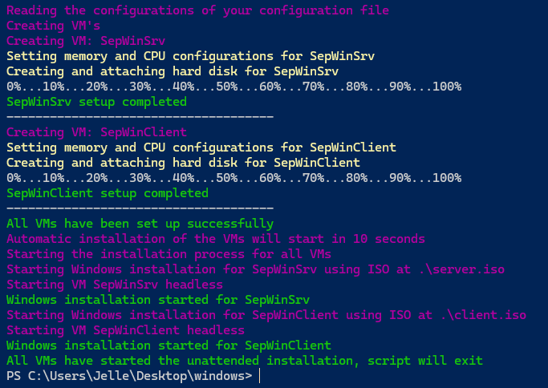
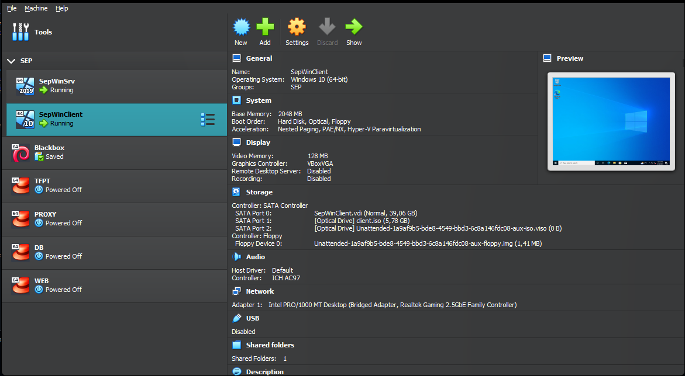
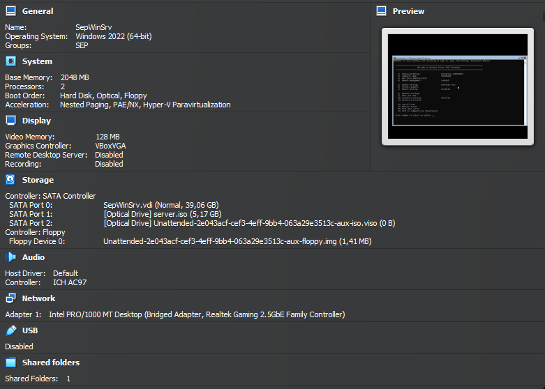
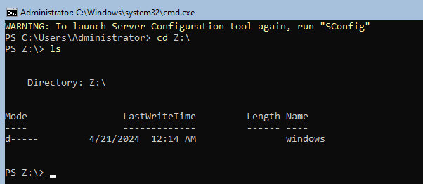

# Testplan VBoxManage

- Auteur(s) testplan: Jelle Van Holsbeeck

## Test: VboxManage script om Windows VMs aan te maken

Testprocedure:

1. Open Powershell in de map van het VBoxManage script
2. Voeg de iso's toe ter vervanging van de dummy files
3. Voer het script uit (eventueel permissions aanpassen om de run toe te laten)

Verwacht resultaat:

- Het script geeft zelf geen errors aan
- VMs werden aangemaakt in VirtualBox
- VMs starten de unattended installatie van Windows

## Test: Resources en bridged adapter correct ingesteld

Testprocedure:

1. Open de VirtualBox GUI
2. Valideer van de VMs dat de resources overeenkomen met het configbestand en de NIC bridged is

Verwacht resultaat:

- Beide VMs komen overeen met waarde uit configbestand en hebben een bridged adapter

## Test: Unattended installation

Testprocedure:

1. Open de Virtualbox GUI en "show" beide VMs
2. Laat de installatie afronden en "show" beide VMs opnieuw

Verwacht resultaat:

- Beide VMs zijn de installatie procedure van Windows gestart
- Beide VMs zijn geinstalleerd en ingelogd met de administrator gebruiker

## Test: Shared folder

Testprocedure:

1. Open de Windows Server VM
2. Exit naar command line met optie "15"
3. Navigeer met `cd` naar de `Z:\` drive
4. Open de Windows Client VM
5. Valideer aan de hand van de GUI of de shared drive aanwezig is

Verwacht resultaat:

- De navigatie lukt, dat wil zeggen dat de shared folder zichtbaar is binnen de VM
- De GUI van de client toont de shared folder

_(Er is een gekende bug dat een reboot soms nodig is voor deze zichtbaar worden, indien bovenstaande acties niet lukken. Probeer dan eerst een manuele reboot)_

