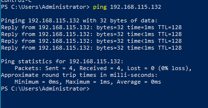
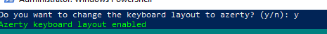
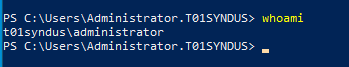
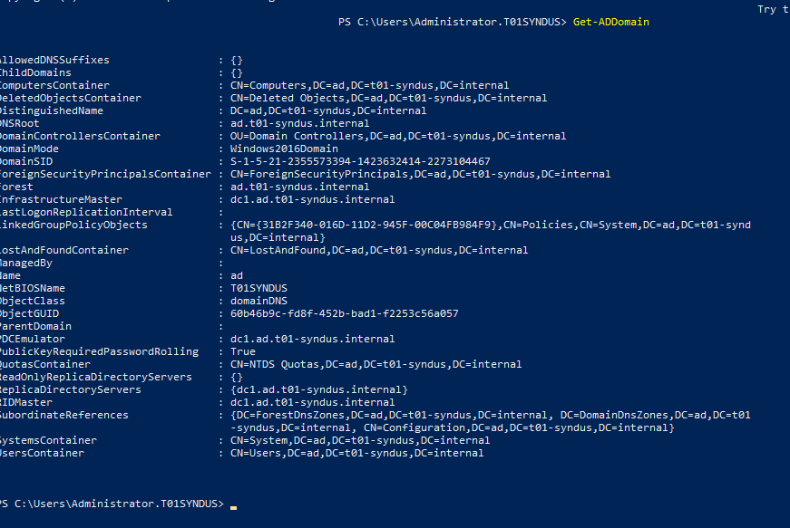
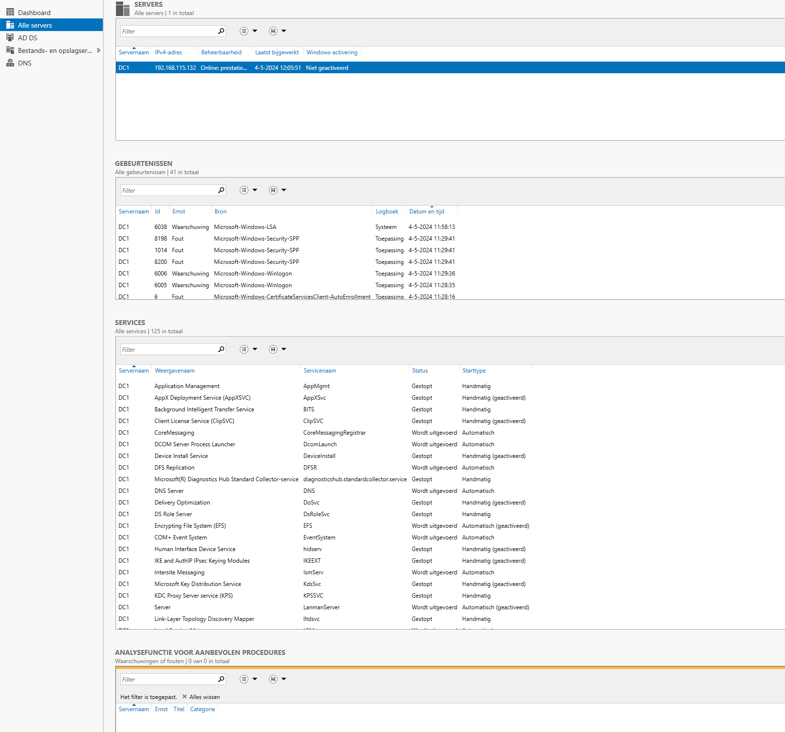
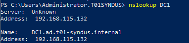

# Testrapport VBoxManage

- Uitvoerder(s) test: Ward
- Uitgevoerd op: 4/5/2024
- Github commit:

## Test: Communicatie naar Windows server 1 is mogelijk

Testprocedure:

1. Open een PowerShell terminal
2. Ping naar `192.168.115.132`

Verkregen resultaat:

-Er is een ping reply

Test geslaagd:

- [x] Ja
- [ ] Nee

Opmerkingen:

## Test: Uitvoering `client1.ps1`

Testprocedure:

1. Navigeer naar de shared folder op `Z:\`
2. Run script `client1.ps1`

Verkregen resultaat:

- Geen errors tijdens uitvoering script
- Het script vraagt om de azerty layout te gebruiken
- Er vindt een automatische reboot plaats

Test geslaagd:

- [x] Ja
- [ ] Nee

## Test: Domein administrator

Testprocedure:

1. Open een powershell terminal
2. Run `whoami`

Verkregen resultaat:

- De console geeft het volgende weer: `t01syndus\administrator`

Test geslaagd:

- [x] Ja
- [ ] Nee

## Test: Domein joined

Testprocedure:

1. Open een powershell terminal
2. Run `Get-ADDomain`

Verkregen resultaat:

- De console geeft een overzicht van ons domein terug

Test geslaagd:

- [X] Ja
- [ ] Nee

## Test: RSAT tools

Testprocedure:

1. Open start > applicaties
2. Controleer over de RSAT tools aanwezig zijn
3. Open server manager
4. Voeg de server toe aan `All Servers`

Verkregen resultaat:

- De RSAT tools zijn aanwezig op de server
- Server manager is aanwezig
- De server toevoegen geeft geen fouten

Test geslaagd:

- [X] Ja
- [ ] Nee

Opmerking:

- De naam van de domeincontroller is nu `B1` ipv `SepWinSrv`

## Test: DNS server

Testprocedure:

1. Open een powershell terminal
2. Run het `nslookup` commando op de domein controller `DB1`

Verwacht resultaat:

- De lookup wordt beantwoord door de DNS op de domain controller
- De record geeft het IP correct terug (192.168.115.132)

Test geslaagd:

- [X] Ja
- [ ] Nee

Opmerking:

- De naam van de domeincontroller is nu `B1` ipv `SepWinSrv`