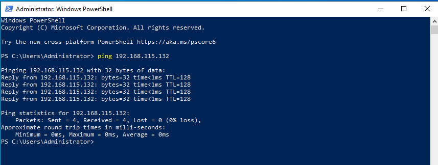
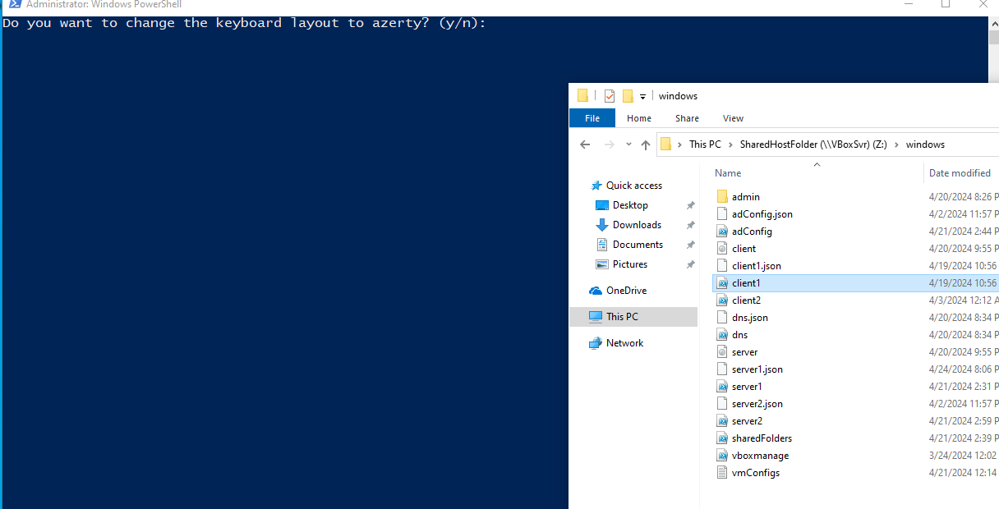
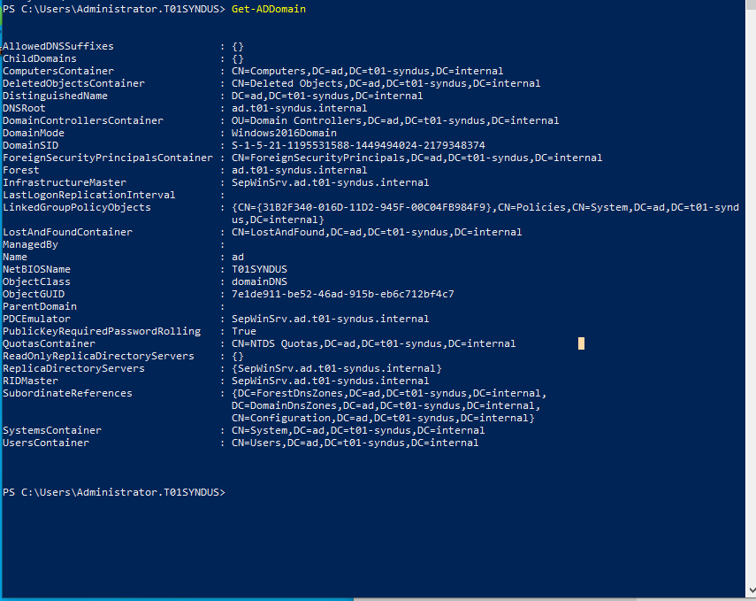
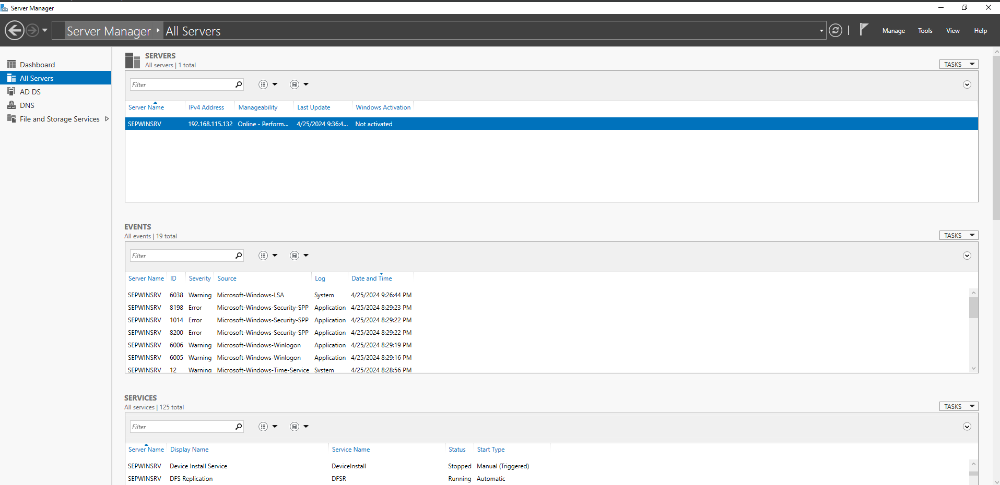
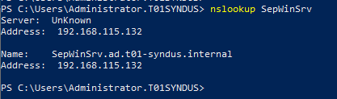

# Testplan Windows Client

- Auteur(s) testplan: Jelle Van Holsbeeck

## Prerequisites

- De Windows server is geconfigureerd en is actief.

## Sidenotes

- Het testplan en de testrapporten worden gedaan met een Nat netwerk interface op een `/24` subnet, om thuis testen mogelijk te maken.

## Test: Communicatie naar Windows server 1 is mogelijk

Testprocedure:

1. Open een PowerShell terminal
2. Ping naar `192.168.115.132`

Verwacht resultaat:

- Er is een ping reply

## Test: Uitvoering `client1.ps1`

Testprocedure:

1. Navigeer naar de shared folder op `Z:\`
2. Run script `client1.ps1`

Verwacht resultaat:

- Er worden geen errors gegeneert tijdens de uitvoering van het script
- Het script vraagt om de azerty layout te gebruiken
- Er vindt een automatische reboot plaats

## Test: Domein administrator

Testprocedure:

1. Open een powershell terminal
2. Run `whoami`

Verwacht resultaat:

- De console geeft het volgende weer: `t01syndus\administrator`

## Test: Domein joined

Testprocedure:

1. Open een powershell terminal
2. Run `Get-ADDomain`

Verwacht resultaat:

- De console geeft een overzicht van ons domein terug

## Test: RSAT tools

Testprocedure:

1. Open start > applicaties
2. Controleer over de RSAT tools aanwezig zijn
3. Open server manager
4. Voeg de server toe aan `All Servers`

Verwacht resultaat:

- De RSAT tools zijn aanwezig op de server
- Server manager is aanwezig
- De server toevoegen geeft geen fouten

## Test: DNS server

Testprocedure:

1. Open een powershell terminal
2. Run het `nslookup` commando op de domein controller `SepWinSrv`

Verwacht resultaat:

- De lookup wordt beantwoord door de DNS op de domain controller
- De record geeft het IP correct terug (192.168.115.132)

