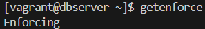
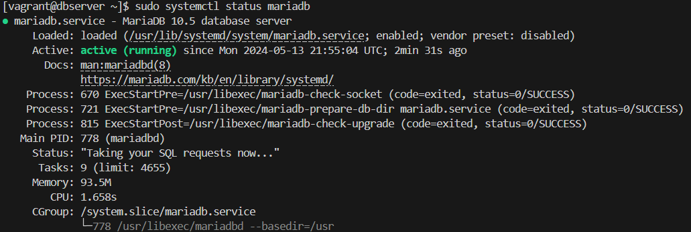
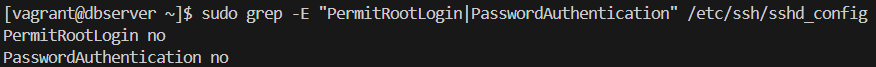
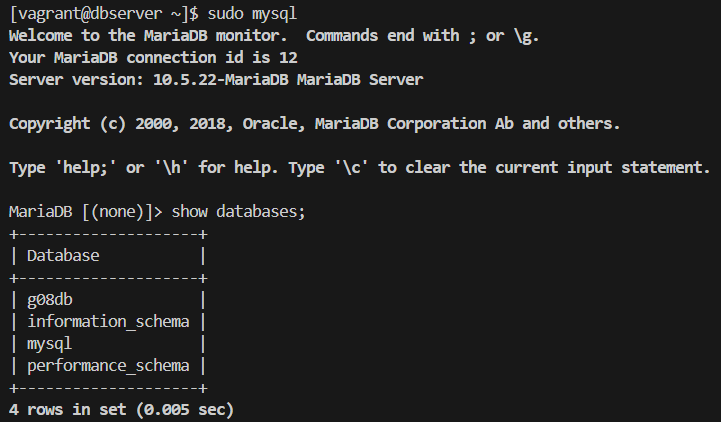

# Testplan: Databaseserver

- Auteur(s) testplan: Thomas De Schepper

## Check basis

Testprocedure:

1. Start de vm op via `vagrant up dbserver` in de directory /uitvoering/machines en log in met `vagrant ssh dbserver`.
2. Check of selinux actief is met het commando `getenforce`.
3. Check of de MariaDB service actief is met het commando `sudo systemctl status mariadb`.
4. Check of root-login en wachtwoordauthenticatie zijn uitgeschakeld met het commando `sudo grep -E "PermitRootLogin|PasswordAuthentication" /etc/ssh/sshd_config`.

Verwacht resultaat:

- Selinux is actief

  

- De MariaDB service is actief

  

- root-login en wachtwoordauthenticatie zijn uitgeschakeld

  

## Check databanken

Testprocedure:

1. Open MariaDB met het commando `sudo mysql`.
2. Check of de database aanwezig is met `show databases;`

Verwacht resultaat:

- MariaDB wordt geopend en de database "g08db" is aanwezig

  