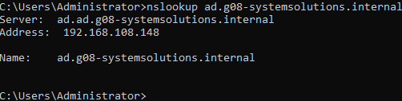
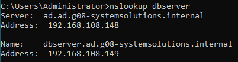

# Testplan

- Auteur(s) testplan: Thomas De Schepper

## Test: Kan de Windows client het domein vinden met nslookup?

Testprocedure:

1. Start de Windows server en Windows client in virtualbox
2. Open command prompt op de Windows client en voer het commando  `nslookup ad.g08-systemsolutions.internal` uit

Verwacht resultaat:

- De Windows server met het bijhorende ip address wordt weergegeven

  

## Test: Kan de Windows client de apparaten binnen het domein vinden met nslookup?

Testprocedure:

1. Open command prompt op de Windows client en voer het commando  `nslookup` uit gevolgd door een apparaat binnen het domein (doe dit voor elk apparaat)

Verwacht resultaat:

- de verwachte server met het bijhorende ip address wordt weergegeven
  
  

## Test: Kan de Windows client de webserver opzoeken?

Testprocedure:

1. Start de webserver op in de terminal met `vagrant up webserver`
2. Open de browser en zoek `webserver` en `http://g08-systemsolutions.internal` op

Verwacht resultaat:

- De webserver verschijnt in de browser

  
  