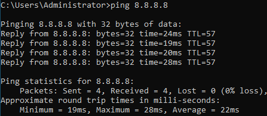

# Testplan

- Auteur(s) testplan: Thomas De Schepper

## Test: Kan de redundante router overnemen na kabelbreuk met de switch?

Testprocedure:

1. Trek da kabel in poort G0/1 op de switch uit.
2. Probeer te pingen van de winclient naar 8.8.8.8 met het commando `ping 8.8.8.8`.

Verwacht resultaat:

- De redundante router neemt over van R1 en de ping slaagt.

   

## Test: Kan de redundante router overnemen na kabelbreuk met de ISP?

1. Trek da kabel in poort G0/0/0 op R1 uit.
2. Probeer te pingen van de winclient naar 8.8.8.8 met het commando `ping 8.8.8.8`.

Verwacht resultaat:

- De redundante router neemt over van R1 en de ping slaagt.

   

## Test: Kan de redundante router overnemen na falen van R1?

1. Zet R1 uit.
2. Probeer te pingen van de winclient naar 8.8.8.8 met het commando `ping 8.8.8.8`.

Verwacht resultaat:

- De redundante router neemt over van R1 en de ping slaagt.

   