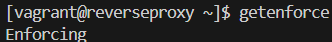
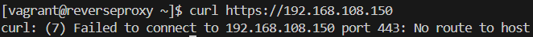
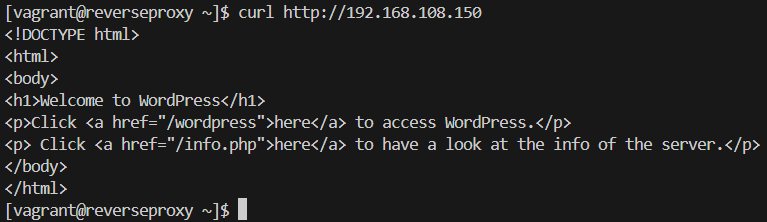
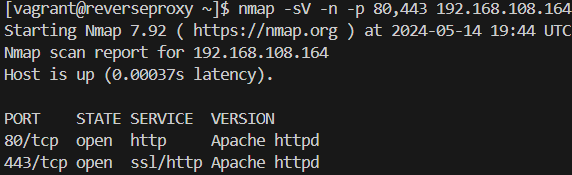

# Testplan: Reverse proxy

- Auteur(s) testplan: Thomas De Schepper

## Check basis 

Testprocedure:

1. Start de vm op via `vagrant up reverseproxy` in de directory /uitvoering/machines en log in met `vagrant ssh reverseproxy`.
2. Check of selinux actief is met het commando `getenforce`.

Verwacht resultaat:

- Selinux is actief

## De winclient en de reverse proxy kunnen enkel een HTTPS verbinding maken

Testprocedure:

1. Op de winclient voer het commando `curl -I http://g08-systemsolutions` uit.

Verwacht resultaat:

- http werkt niet, er wordt een foutmelding gegeven en de juiste locatie wordt teruggegeven (https)

## De reverse proxy en de webserver kunnen enkel HTPP verbinding maken

Testprocedure: 

1. Op de reverse proxy voer het commando `curl https://192.168.108.150` uit.
2. Op de reverse proxy voer het commando `curl http://192.168.108.150` uit.

Verwacht resultaat:

- HTTPS krijgt geen reactie

  

- HTTP werkt wel

  

## Uitvoeren van een nmap-scan

Testprocedure:

1. Voer het commando `nmap 192.168.108.164` op de reverse proxy uit.
2. Voer het commando `nmap -sV -n -p 80,443 192.168.108.164` op de reverse proxy uit.

Verwacht resultaat:

- De nmap-scan geeft de verkeerde informatie weer over de versie van de webserver en http header info.

  

- De nmap-scan geeft de services niet weer op poorten 80 en 443.

  