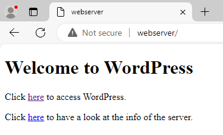

# Testplan: Webserver

- Auteur(s) testplan: Phil van Akoleyen, Thomas De Schepper

## Check basis 

Testprocedure:

1. Start de vm op via `vagrant up webserver` in de directory /uitvoering/machines en log in met `vagrant ssh webserver`.
2. Check of selinux actief is met het commando `getenforce`.
3. Check of de Apache-service actief is met het commando `sudo systemctl status httpd`.
4. Ping de database met het commando `ping 192.168.108.149`

Verwacht resultaat:

- Selinux is actief

## Check instellingen

1. Check apache instellingen `sudo cat /etc/httpd/conf/httpd.conf | grep -E "ServerTokens|ServerSignature`

## Test: kan je met een client een post aanmaken op wordpress?

Testprocedure:

1. Start de webserver en databaseserver op in de terminal met `vagrant up webserver` en `vagrant up dbserver`.
2. Start de Windows client op in virtualbox. 
3. Open op de client microsoft edge en surf naar http://192.168.108.150

4. klik op de here link naar wordpress en hoover met je muis over het plusje met new en kies voor post uit de lijst. 

5. voer in wat je wenst in je post en klik vervolgens op publish 

Verwacht resultaat: 

- De Client heeft een post aangemaakt. 

